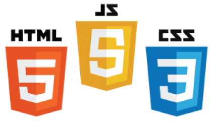
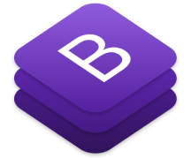

<h1>  AttitudePlay </h1>
<h2>Projeto</h2>
<h3>Site de serviço de streaming de filmes e séries totalmente responsivo desenvolvido como projeto de conclusão do Módulo 2 da <a href="https://www.resilia.com.br/"> Resilia</a></h3>
<h3>Elementos:</h3>
<ul>
    <li>Home</li>
    <li>Tela de Busca</li>
    <li>Tela de Informação do Filme/Série</li>
    <li>Tela de Login</li>
    <li>Tela de Cadastro</li>
    <li>Tela de Recuperar Senha</li>
    <li>Tela de Especificações</li>
    <li>Tela de Parceiros</li>
    <li>Tela de Contatos dos Autores</li>
    <li>Tela de Sugestões</li>
</ul>
<h4>* Todas as telas possuem uma barra de navegação e um rodapé padrão</h4>

<h2>Demonstração</h2>
<h3>. . . Em construção</h3>

 
<h2 style="margin-bottom: 30px">Tecnologias utilizadas</h2>
 
 
 
 
 
 

<h2>APIs utilizadas</h2>
<li style="margin: 10px 0; font-size: 16px"><a href="http://www.omdbapi.com/">API OMDb</a></li>
<li style="margin: 10px 0; font-size: 16px"><a href="https://viacep.com.br/">API ViaCEP</a></li>

<h2>Padrão de Projeto</h2>
<h3><li>Padrão MVC</li></h3>

<h2>Colaboradores</h2>

    <h2  style="font-weight: bold; letter-spacing: 1px; margin: 20px 0 10px 0">Eric Rodrigues</h2>
    

        
        
    

    <h2  style="font-weight: bold; letter-spacing: 1px; margin: 20px 0 10px 0">Murilo Antunes</h2>
    

        
        
    

    <h2  style="font-weight: bold; letter-spacing: 1px; margin: 20px 0 10px 0">Vinicius Teixeira</h2>
    

        
        
    

    <h2  style="font-weight: bold; letter-spacing: 1px; margin: 20px 0 10px 0">Vitor Giorgio</h2>
    

        
        
    

    <h2  style="font-weight: bold; letter-spacing: 1px; margin: 20px 0 10px 0">Vitor Silva</h2>
    

        
        
    

 
